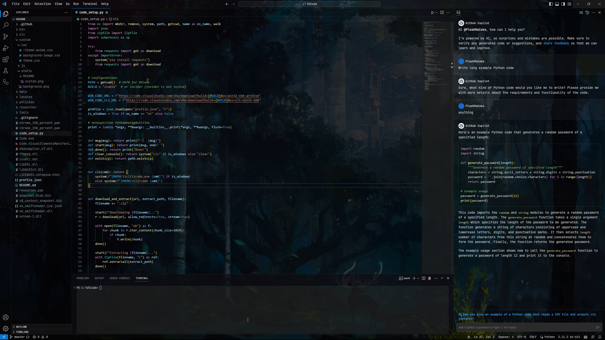
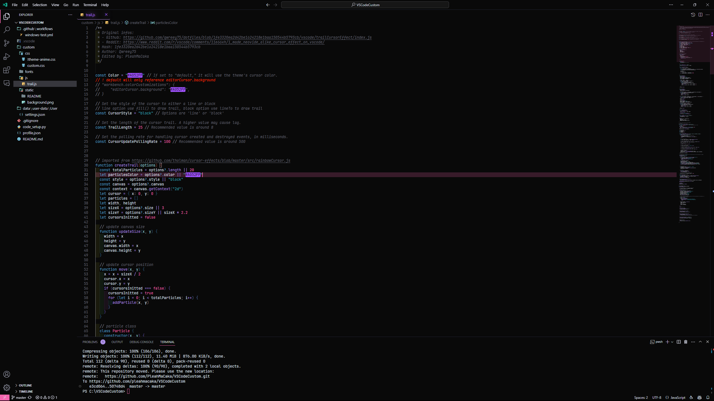
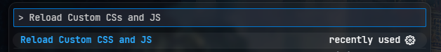

# A-VSC-C

## Preview

| Default | Custom |
|:-------:|:------:|
|  |  |

## Installation

### For Windows  
>
> ```console
> git clone https://github.com/PleahMaCaka/VSCodeCustom VSCode && cd VSCode && python code_setup.py
> ```
> and then  
> 
> 

### For Linux
>
> ```console
> $ Not Tested Yet
> ```
